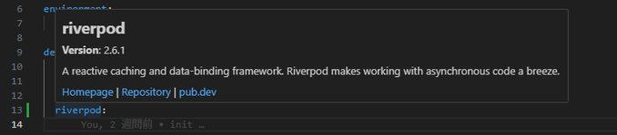

# Dart Pub Info

**Dart Pub Info** is a Visual Studio Code extension that displays package information when hovering over package names in the `pubspec.yaml` file of a Dart project.

## Features

This extension provides the following features:

- Detects package names inside the `pubspec.yaml` file
- Fetches package information from the [pub.dev API](https://pub.dev) when hovering over a package name
- Displays the latest version, description, homepage, repository, and a link to pub.dev

### Example Usage

1. Open the `pubspec.yaml` file of a Dart project
2. Hover over a package name under the `dependencies` or `dev_dependencies` section
3. A tooltip will appear showing detailed information about the package

## Requirements

To use this extension, you will need:

- Visual Studio Code version 1.98.0 or higher
- An internet connection (required to fetch package data)

## Extension Settings

There are currently no configurable settings for this extension.

## Known Issues

- If package information fails to load, an error message will be displayed
- Some packages may have incomplete information available from the pub.dev API

## Release Notes

### 0.0.1

- Initial release
- Display package info on hover within the `pubspec.yaml` file

---

## Following Extension Guidelines

Make sure you've read through the [Extension Guidelines](https://code.visualstudio.com/api/references/extension-guidelines) and are following best practices for extension development.

## Working with Markdown

You can edit this `README.md` using Visual Studio Code. Here are some helpful tips:

- Split the editor (`Cmd+\` on macOS or `Ctrl+\` on Windows/Linux)
- Toggle preview (`Shift+Cmd+V` on macOS or `Shift+Ctrl+V` on Windows/Linux)
- Press `Ctrl+Space` to trigger Markdown snippet suggestions

## For More Information

- [Visual Studio Code's Markdown Support](https://code.visualstudio.com/docs/languages/markdown)
- [Markdown Syntax Reference](https://help.github.com/articles/markdown-basics/)

**Enjoy!** 🚀
